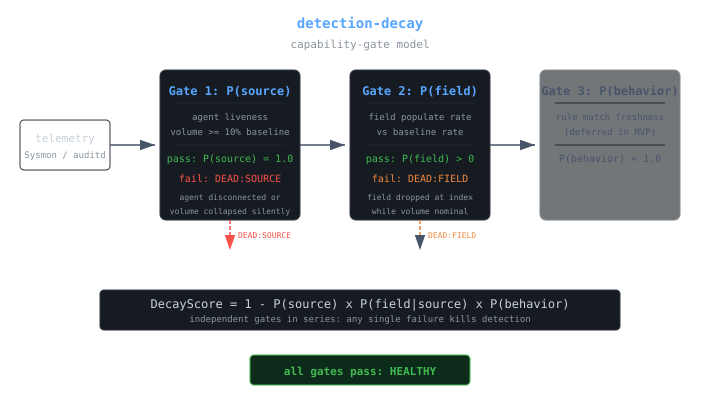
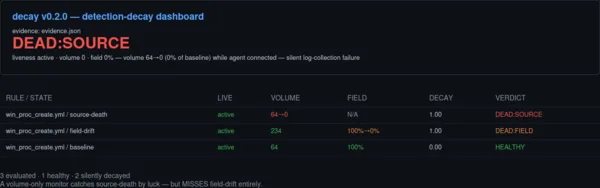
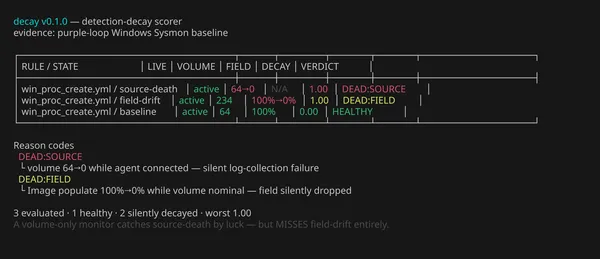

# detection-decay

> Silent detection failure monitoring for SIEM detection engineers — catches source-death and field-drift that volume-only monitors miss.

[](https://go.dev)
[](LICENSE)
[](https://github.com/jayelbotvibe-web/detection-decay/actions/workflows/go.yml)

**The silent-detection-failure problem.** Your SIEM agent shows Active. Event volume looks healthy. But two things can silently kill detection without any conventional monitor catching them:

1. **Source death** — the telemetry source stops sending events (log-collection config disabled, channel dropped) while the agent stays connected.
2. **Field drift** — a critical field goes null at the index (schema change, pipeline bug, decoder upgrade) while events keep flowing.

**detection-decay** solves this with a capability-gate model that decomposes detection integrity into three independent links:

```text
DecayScore = 1 - P(source_ok) * P(field_ok|source_ok) * P(behavior)
```



> **Unlike volume-based monitors** (elastalert, Grafana alerts, Wazuh agent status checks) that only catch source death by accident, detection-decay explicitly models field-level integrity. If your Sigma rule depends on `Image` being populated and your ingest pipeline silently drops that field — no volume alert fires, but detection-decay catches it.

## Who this is for

**Detection engineers and purple teamers** running SIEM detection pipelines (Wazuh, Elastic, Splunk) who need to know when their detections silently break — not just when the agent disconnects.

## What it is (and isn't)

| This IS | This is NOT |
|---------|-------------|
| A capability-gate scoring model for detection health | A SIEM replacement or log aggregator |
| An evidence-driven decay scorer with CLI + HTML output | A real-time monitoring service (yet — see roadmap) |
| SIEM/source-agnostic (model works on any indexed telemetry) | A Sigma rule validator or detection-as-code tool |

## Scoring model

Each gate is checked independently against a healthy baseline:

| Gate | Measurement | Fails when |
|------|------------|------------|
| **P(source)** | Agent liveness + event volume | Agent disconnected, or volume < 10% of baseline |
| **P(field)** | Field populate rate vs baseline | Critical field goes null on new events |
| **P(behavior)** | Rule match freshness | Deferred in MVP (= 1.0) |

A verdict is assigned per rule-state pair: `HEALTHY`, `DEAD:SOURCE`, `DEAD:FIELD`, or `INSUFFICIENT_DATA`.

## Demonstrated failure modes

Both on real Windows Sysmon EID 1 telemetry from a Wazuh SIEM lab (the scoring model is SIEM/source-agnostic):

**Source death** — Sysmon channel collection disabled in agent config. Agent stays Active. Volume collapses 64→0.



**Field drift** — `data.win.eventdata.image` removed at the index via ingest pipeline. Volume stays at 234 events. Field populate collapses 100%→0%.



## Install

Requires Go 1.22+.

```bash
git clone https://github.com/jayelbotvibe-web/detection-decay.git
cd detection-decay
go build ./cmd/decay
```

Or install directly:

```bash
go install github.com/jayelbotvibe-web/detection-decay/cmd/decay@latest
```

## Usage

Score a static evidence file (both forms work):

```bash
./decay score --evidence evidence.json
./decay --evidence evidence.json        # bare-flags form also works
```

Generate an HTML dashboard:

```bash
./decay score --evidence evidence.json --format html --out demo/dashboard.html
```

The evidence format is a JSON array of measurement rows:

```json
[
  {
    "rule": "win_proc_create.yml",
    "state": "field-drift",
    "liveness": "active",
    "volume": 234,
    "baseline_volume": 64,
    "field_populate": 0.0,
    "baseline_field_populate": 1.0
  }
]
```

### Generating evidence from a live index

`scripts/collect-opensearch.sh` measures volume and field-populate rate directly from a Wazuh indexer / OpenSearch / Elasticsearch endpoint and writes scorer-ready evidence. Credentials come from environment variables — never hardcode them:

```bash
export DECAY_ES_URL="https://127.0.0.1:9200"
export DECAY_ES_USER="admin"
export DECAY_ES_PASS="<indexer password>"

# capture a healthy baseline once
echo '{"baseline_volume": 64, "baseline_field_populate": 1.0}' > baseline.json

# collect and score
./scripts/collect-opensearch.sh \
  --index 'wazuh-alerts-*' \
  --rule win_proc_create.yml \
  --field data.win.eventdata.image \
  --filter 'data.win.system.eventID:1' \
  --window 15m \
  --baseline baseline.json \
  --out evidence-live.json

./decay score --evidence evidence-live.json
```

Requires `curl` and `jq`. Use `--insecure` (or `DECAY_ES_INSECURE=1`) for self-signed lab certificates. If zero events are returned, `field_populate` is emitted as `null` so the scorer abstains instead of guessing.

## Roadmap

- [x] **Live mode** (`--live`) — poll Wazuh APIs directly (shipped on `feat/live-mode` branch; pending merge)
- [ ] **P(behavior) gate** — rule match freshness scoring (time since last alert match)
- [ ] **Multi-rule scope** — calibrate across full Sigma rule sets, not just `win_proc_create.yml`
- [ ] **Alerting integration** — webhook/Slack/PagerDuty when decay is detected
- [ ] **Closed calibration loop** — run probes, score results, feed back into baseline

## Limitations

- **Evidence-driven MVP**: the scorer reads static JSON; live measurement is via the reference collector script (`scripts/collect-opensearch.sh`), not a built-in poller.
- **P(behavior) deferred**: alert freshness not yet modeled.
- **Single-rule scope**: currently calibrated for `win_proc_create.yml` only.
- **No closed calibration loop**: the tool scores probes but does not run them.

⭐ **Star this repo** if you've hit silent detection decay in production. [Issues](https://github.com/jayelbotvibe-web/detection-decay/issues) and PRs welcome.

## License

MIT — see [LICENSE](LICENSE).
