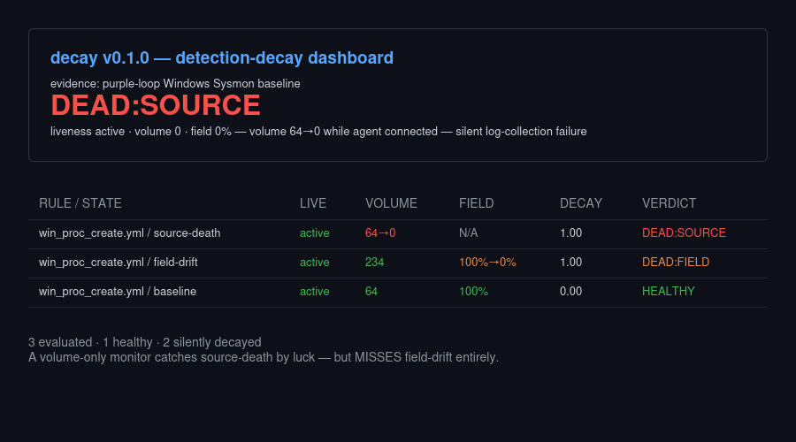
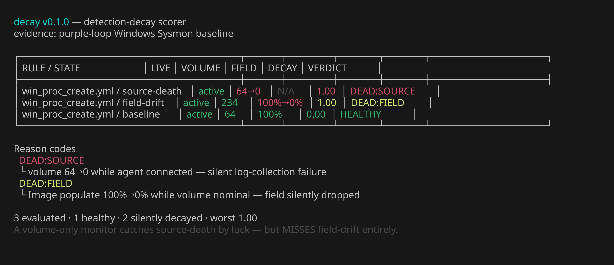

# detection-decay

**The silent-detection-failure problem.** Your SIEM agent shows Active. Event volume looks healthy. But two things can silently kill detection without any conventional monitor catching them: **(a) source death** — the telemetry source stops sending events (log-collection config disabled, channel dropped) while the agent stays connected; and **(b) field drift** — a critical field goes null at the index (schema change, pipeline bug, decoder upgrade) while events keep flowing. A volume-only monitor catches (a) by luck but completely misses (b).

**detection-decay** solves this with a capability-gate model that decomposes detection integrity into three independent links:

```
DecayScore = 1 − P(source_ok) · P(field_ok|source_ok) · P(behavior)
```

Each gate is checked independently against a healthy baseline:
- **P(source)**: agent connected + volume ≥ 10% of baseline → 1.0; else 0.
- **P(field)**: field populate rate / baseline rate, clamped to [0,1]; ABSTAIN if no field data.
- **P(behavior)**: rule match freshness (deferred in MVP → 1.0).

A verdict is assigned per rule-state pair: HEALTHY, DEAD:SOURCE, DEAD:FIELD, or INSUFFICIENT_DATA.

## Demonstrated failure modes

Both on real Windows Sysmon EID 1 telemetry from a Wazuh SIEM lab.




## Quickstart

### Static evidence mode
```bash
git clone https://github.com/jayelbotvibe-web/detection-decay.git
cd detection-decay
go build ./cmd/decay
./decay score --evidence evidence.json
```

### Live mode (v0.2.0)

Queries the Wazuh indexer and manager API directly for real measurements:

```bash
cp .env.example .env  # edit with your lab credentials
export $(grep -v '^#' .env | xargs)
./decay score --live --config rules.yaml
```

Environment variables: `INDEXER_URL`, `INDEXER_USER`, `INDEXER_PASS`, `WAZUH_API_URL`, `WAZUH_API_USER`, `WAZUH_API_PASS`. See `.env.example`.

## Scoring model

| Gate | Measurement | Fails when |
|------|------------|------------|
| P(source) | Agent liveness + event volume | Agent disconnected, or volume < 10% of baseline |
| P(field) | Field populate rate vs baseline | Critical field goes null on new events |
| P(behavior) | Rule match freshness | Deferred (MVP = 1.0) |

## Limitations

- **Evidence-driven**: static mode reads JSON; live mode queries indexer but still needs baseline calibration.
- **P(behavior) deferred**: alert freshness not yet modeled.
- **Single-rule scope**: currently calibrated for `win_proc_create.yml` only.
- **Hardcoded field map**: `rules.yaml` maps fields manually — real Sigma YAML parsing is future work.

## License

MIT — see [LICENSE](LICENSE).
