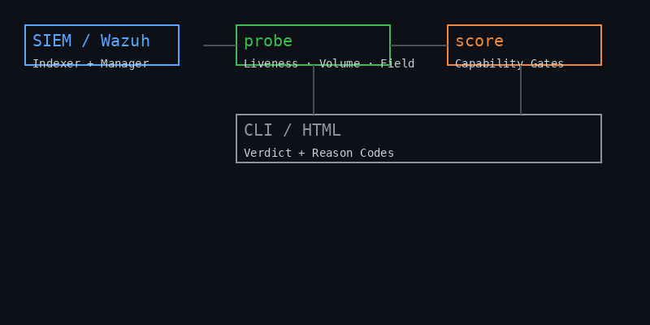

# detection-decay

*Catch silent SIEM detection failures before they become blind spots.*


## The problem

Your SIEM agent shows **Active**. Event volume looks **healthy**. Your dashboard is **all green**. But your detection rules are **dead** — and no conventional monitor catches it.

Two failure modes kill detection silently:

- **Source death** — the telemetry source stops sending events (log-collection config disabled, channel dropped) while the agent stays connected. A basic "is the agent up?" check sees nothing wrong.
- **Field drift** — a critical field goes null at the index (schema change, pipeline bug, decoder upgrade) while events keep flowing. A volume-only monitor is **completely blind** to this.

**detection-decay** decomposes detection integrity into independent gates and scores each one against a healthy baseline.

## Architecture



Interactive: [docs/architecture.html](docs/architecture.html)

## How it works

```
DecayScore = 1 − P(source_ok) · P(field_ok|source_ok) · P(behavior)
```

Each gate is checked independently against a healthy baseline:

| Gate | Measurement | Fails when |
|------|------------|------------|
| **P(source)** | Agent liveness + event volume | Agent disconnected, or volume < 10% of baseline |
| **P(field)** | Field populate rate vs baseline | Critical field goes null on new events |
| **P(behavior)** | Rule match freshness | Deferred (MVP = 1.0) |

**Verdicts** assigned per rule-state pair:

| Verdict | Meaning |
|---------|---------|
| `HEALTHY` | All gates pass |
| `DEAD:SOURCE` | Agent disconnected or volume collapsed |
| `DEAD:FIELD` | Field populated dropped to 0 while volume healthy |
| `INSUFFICIENT_DATA` | Field data missing, cannot score |
| `PROBE_ERROR` | **Measurement failed** — the tool couldn't reach the SIEM. Never reported as a detection failure. |

A failed measurement (unreachable indexer, API timeout) returns `PROBE_ERROR`, not `DEAD:SOURCE`. The tool refuses to fabricate a death verdict from data it couldn't measure.

## Two modes

### Static evidence (no lab needed)
```bash
./decay score --evidence evidence.json
```
Reads pre-captured measurements from JSON. Included with the repo — run it with zero setup.

### Live mode (queries your SIEM)
```bash
cp .env.example .env   # edit with your lab credentials
export $(grep -v '^#' .env | xargs)
./decay score --live --config rules.yaml
```
Queries your Wazuh indexer and manager API for real measurements. See [DEPLOYMENT.md](DEPLOYMENT.md) for full setup.

## Demonstrated failure modes

All three rule-states scored from real Windows Sysmon EID 1 telemetry:


Both screenshots show the same three states: baseline (HEALTHY), source-death (DEAD:SOURCE), and field-drift (DEAD:FIELD).

## Quickstart

```bash
git clone https://github.com/jayelbotvibe-web/detection-decay.git
cd detection-decay
go build ./cmd/decay

# Try it now — no lab needed
./decay score --evidence evidence.json
```

For live mode against your own SIEM, see [DEPLOYMENT.md](DEPLOYMENT.md).

## Limitations & roadmap

**Current limitations (MVP)**
- **Single-rule config**: calibrated for `win_proc_create.yml` only. Multi-rule on the roadmap.
- **P(behavior) deferred**: alert freshness not yet modeled (placeholder 1.0).
- **Calibration loop not closed**: the tool scores probes but does not run them autonomously.
- **Demo vs live**: the evidence.json demo is pre-captured; live mode requires a real lab.

**Next**
- Multi-rule Sigma YAML parsing — auto-discover field paths from rule files
- Freshness gate — measure `LAST_MATCH` staleness
- Closed calibration — the tool runs probes, scores, and re-checks against known-good emulation

## License

MIT — see [LICENSE](LICENSE).
